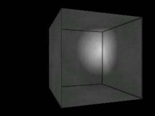

This article provides an introduction to writing pixel shaders with the Cg shader programming language and using them in OpenGL with the ARB_fragment_program extension. It contains sample C and Cg code and is accompanied by a simple diffuse lighting demo with full source code.

## Shaders

Simply put, shaders are small programs that are executed on a per-vertex or per-pixel basis. Vertex Shaders (also sometimes called Vertex Programs) are executed on each vertex that's processed by the graphics API. Pixel Shaders (also sometimes called Fragment Shaders or Fragment Programs) are executed on each pixel that's rendered.

The powerful flexibility enabled by shaders is probably the biggest advance in real-time graphics programming in the past several years. Most modern GPUs, particularly ones made by NVIDIA and ATI, support vertex and pixel shaders. [Mesa](http://www.mesa3d.org/), a software-based OpenGL-compatible graphics library, also supports shaders; you may want to check that out if you have an older graphics card that doesn't have shader support, but it will obviously run very slow compared to a hardware implementation.

## Cg

Cg ("C for graphics") is a high-level shader programming language developed by NVIDIA. As its name implies, its syntax and semantics are very similar to those of the C programming language.

There are many different low-level (assembly-like) shader languages that different APIs (such as OpenGL and Direct3D), and even different GPUs, may support. Cg allows you you to write one shader and use it with practically any API and GPU; the Cg compiler from NVIDIA can generate output in many of the low-level shader languages, including OpenGL's ARB_fragment_program language that's used for this article. It's important to note, however, that not all low-level languages have the same feature sets, and some Cg programs that can be compiled into newer low-level languages may not compile into older low-level languages.

If you haven't yet, you may want to download the [NVIDIA Cg Toolkit](http://developer.nvidia.com/object/cg_toolkit.html), which contains the NVIDIA Cg Compiler and some good documentation.

## Loading Pixel Shaders in OpenGL

Before we get begin writing shaders, we should have a way to load them and use them. There are some different shader extensions for OpenGL. In this article, I'll show you how to use the ARB_fragment_program extension. Note that you may need to create and set function pointers using wglGetProcAddress(), glXGetProcAddress(), or some other equivalent function to use the gl*Program*ARB functions shown below; the demo accompanying this article contains code for setting such pointers, which are prefixed with "my_", in the set_function_pointers function in scene.c.

To load and use an ARB_fragment_program shader, we first need to enable the ARB_fragment_program extension:

```c++
​    glEnable(GL_FRAGMENT_PROGRAM_ARB);
```

Next, we generate a shader number (which is an unsigned integer) to identify the shader with, then bind that shader number. We use the glGenProgramsARB and glBindProgramARB functions for this, which are similar to the glGenTextures and glBindTexture functions. The shader_num variable must be declared somewhere before these function calls, of course.

```c++
​    glGenProgramsARB(1, &shader_num);
    glBindProgramARB(GL_FRAGMENT_PROGRAM_ARB, shader_num);
```

Now we must actually load the the shader. To load a shader with the ARB_fragment_program extension, you must pass a string that contains the full ARB_fragment_program assembly code for the shader to the glProgramStringARB function. For example, if the pointer program_string points to the string containing the full shader code, then you would call:

```c++
​    glProgramStringARB(GL_FRAGMENT_PROGRAM_ARB, GL_PROGRAM_FORMAT_ASCII_ARB, strlen(program_string), program_string);
```

At this point, our shader has been loaded and we're ready to use it. Just to be safe, we'll disable fragment programs (pixel shaders) for now and enable them later when needed:

```c++
​    glDisable(GL_FRAGMENT_PROGRAM_ARB);
```

The demo's full shader loading code can be found in the load_shader function in scene.c.

## A Simple Cg Pixel Shader

Now it's time to actually create a pixel shader with Cg. As mentioned earlier, Cg is very similar to C in its syntax, so if you're familiar with that language, it shouldn't be too difficult for you to pick up. The shader described below will simply calculate a diffuse lighting value and modify the current pixel's color value appropriately.

In this shader, we'll use the second texture unit's texture coordinates to represent the pixel's position minus the light's position, which will be used for calculating the squared distance between the light and the pixel. To do this, we simply set the second texture unit's texture coordinates to the position of each vertex minus the light's position as we pass each vertex to OpenGL, and those values will be interpolated across each pixel of every polygon. For example, if vertexpos is the vertex position and lightpos is the light position, then this would look like:

```c++
​    glMultiTexCoord3f(GL_TEXTURE1_ARB, vertexpos[0] - lightpos[0], vertexpos[1] - lightpos[1], vertexpos[2] - lightpos[2]);
    glVertex3f(vertexpos[0], vertexpos[1], vertexpos[2]);
```

When writing the demo, I used a simple macro named VERTEX to make this easier; it's defined as follows:

```c++
​    #define VERTEX(x,y,z) \
        my_glMultiTexCoord3fARB(GL_TEXTURE1_ARB, (x) - lightpos[0], (y) - lightpos[1], (z) - lightpos[2]); \
        glVertex3f((x), (y), (z));
```

Now let's get to the pixel shader itself. First, we'll create a structure containing the pixel input data that we'll need:

```c++
​    struct pixel_in {
        float3 color : COLOR0;
        float3 texcoord : TEXCOORD0;
        float3 lightdist : TEXCOORD1;
    };
```

The pixel_in structure contains three 3D vectors named color, texcoord, and lightdist. The "COLOR0", "TEXCOORD0", and "TEXCOORD1" labels are called binding semantics, and they simply indicate what each variable represents. For example, TEXCOORD0 represents the texture coordinates for the first texture unit and it's associated with the texcoord variable, so the texcoord variable contains the first texture unit's texture coordinates.

This structure will be one of the parameters to the shader's entry point function, called "main", as is the case with C/C++ programs. You could also just specify each member variable of the pixel_in structure as a parameter to main, but I like to put them in a structure just because it looks cleaner.

Next, we create a structure named pixel_out, which will be returned by the main function. All this contains is the final color of the pixel:

```c++
​    struct pixel_out {
        float3 color : COLOR;
    };
```

Now it's time to write the main function. First, the definition:

```c++
​    pixel_out
    main(pixel_in IN, uniform sampler2D texture : TEXUNIT 0)
    {
        pixel_out OUT;
```

The texture variable represents the texture that's bound to the first texture unit.

Next, we calculate the diffuse lighting factor of the current pixel. The lightdist variable, which is represented by the second texture unit's texture coordinates, won't actually be used for texturing; it simply represents the current vertex's position minus the light's position. We'll dot lightdist by itself to get the squared distance, then raise that to the power of 0.5 using the pow function (raising the result to a power between 0 and 1 simply makes the light appear softer; raising it to a power higher than 1 would make it have harder edges); we use the clamp function to make sure the result is in the range of 0 to 1:

```c++
​        float d = clamp(1.0 - pow(dot(IN.lightdist, IN.lightdist), 0.5), 0.0, 1.0);
```

The next line of code is a texture lookup using the tex2D function; we pass it the texture variable and the texture coordinates, and it returns the color of the appropriate pixel from the texture. The "." right after the tex2D function call is the "swizzle" operator, and it causes the order of a vector to be rearranged based on the characters following it; in this case, the ".rgb" at the end means that we only want the red, green, and blue components of the color to be returned, rather than the red, green, blue, and alpha components:

```c++
​        float3 color = tex2D(texture, IN.texcoord).rgb;
```

Finally, we set the output color of the current pixel and return it. The 0.4 is an ambient lighting value that's added to the diffuse value:

```c++
​        OUT.color = color * (d + 0.4);

        return OUT;
    }
```

And we're done with the shader. It can now be compiled with a command like this, using NVIDIA's Cg compiler for Linux:

```c++
​    cgc -profile arbfp1 -o shader.pso shader.cg
```

In the command above, the "-profile arbfp1" tells the Cg compiler to use the ARB_fragment_program profile so that it outputs ARB_fragment_program code, the "-o shader.pso" tells it to output the ARB_fragment_program code to a file named shader.pso, and the shader.cg is just the filename of the file containing the Cg pixel shader code to be compiled.

In the demo, the polygons are rendered with code like this (using the VEREX macro as defined above):

```c++
​    glEnable(GL_FRAGMENT_PROGRAM_ARB);
    my_glBindProgramARB(GL_FRAGMENT_PROGRAM_ARB, shader_num);

    glBegin(GL_QUADS);
        glTexCoord2f(0.0f, 0.0f);
        VERTEX(-1.0f, 1.0f, 0.0f);
        glTexCoord2f(0.0f, 1.0f);
        VERTEX(-1.0f, -1.0f, 0.0f);
        glTexCoord2f(1.0f, 1.0f);
        VERTEX(1.0f, -1.0f, 0.0f);
        glTexCoord2f(1.0f, 0.0f);
        VERTEX(1.0f, 1.0f, 0.0f);

        ...

    glEnd();
```

Here's a screenshot of the demo program:

    

The C source code for the demo (along with the Cg shader code) can be found [on GitHub](https://github.com/joshb/cglighting). The demo requires GLUT, in addition to an OpenGL implementation with ARB_fragment_program support.
