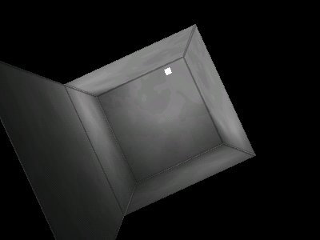

This article explains how to implement dynamic lightmaps in OpenGL with multitexturing. Features sample C code and is accompanied by a demo written in C.

## Lightmaps

First, a short explanation of lightmaps, in case you're not already familiar with them. A lightmap is a texture, with each of its pixels being a lighting value that another texture's corresponding pixel is combined with. In this article, we'll be multiplying each surface's texture by its corresponding lightmap. Each pixel of the lightmap represents a number between 0.0 and 1.0; so if a pixel on an RGB texture is (0.0, 0.0, 1.0), and it's multiplied by the corresponding pixel on its lightmap that equals (0.5, 0.5, 0.5), the resulting, combined pixel would be (0.0, 0.0, 0.5).

This type of texture combining can be achieved with OpenGL's multitexturing functionality. The main reason for using OpenGL's multitexturing functionality, rather than creating the combined textures manually and sending them to the video card, is that lightmaps can be much smaller than the texture they're lighting and still give very good visual results. Since different surfaces often use the same texture, but require different lightmaps, this can save a lot of texture memory and bandwidth in a complex scene.

Now let's take a look at how to implement dynamically generated lightmaps.

## Geometry information

Here's the structure we'll use for storing surfaces:

```c++
​    struct surface {
        float vertices[4][3];
        float matrix[9];

        float s_dist, t_dist;
    };
```

For each surface that will be lightmapped, there's a rotation matrix that will convert a vector from the surface's texture space to world space, since the light's position will be specified in world space.

In the demo I've developed for this article, creating this matrix is easy enough: For each quadrilateral surface, the first vertex is where the top left corner of its texture is mapped to, the second vertex is where the bottom left corner of its texture is mapped, the third vertex is where the bottom right corner of its texture is mapped to, and the fourth vertex is where the top right corner of its texture is mapped to.

The X axis of the matrix should point in the world space direction of the S texture coordinate (that is, from the top left corner to the top right corner). So we take the fourth vertex (the top right corner), subtract the first vertex (the top left corner), normalize the result, and we have the X axis. Getting the Y axis is similar: it should point in the world space direction of the T texture coordinate (top left to bottom left corners), so we take the second vertex (the bottom left corner), subtract the first vertex (the top left corner), and normalize the result. We now have the Y axis. The Z axis is the surface's normal, and is equal to the cross-product of the X axis and Y axis.

We also need to know the world space distances between the surface's top left corner and top right corner (**s_dist** in the surface structure), and the surface's top left corner and bottom left corner (**t_dist** in the surface structure). This is so we know how far apart, horizontally and vertically, each pixel of the lightmap should be in world space, which we need to know in order to get a correct lighting value for each pixel. s_dist is equal to *sqrt(dot_product(v4 - v1, v4 - v1))*, where v4 is the fourth vertex and v1 is the first vertex. t_dist is equal to *sqrt(dot_product(v2 - v1, v2 - v1))*, where v2 is the second vertex and v1 is the first vertex.

All of the above is done in the **new_surface** function in the demo.

## Creating the Lightmaps

The generation of lightmaps is done in a function called **generate_lightmap**. It takes a pointer to a surface as an argument, and returns a texture number that can be used in a glBindTexture call.

Right above the function, we have two global arrays of three floats: **light_pos**, which contains the position of the light in the scene, and **light_color**, which contains the color of the light in the scene. They're initialized like so:

```c++
​    static float light_pos[3] = { 1.0f, 0.0f, 0.25f };
    static float light_color[3] = { 1.0f, 1.0f, 1.0f };
```

Now let's take a look at the generate_lightmap function:

```c++
​    static unsigned int
    generate_lightmap(struct surface *surf)
    {
        static unsigned char data[LIGHTMAP_SIZE * LIGHTMAP_SIZE * 3];
        static unsigned int lightmap_tex_num = 0;
        unsigned int i, j;
        float pos[3];
        float step, s, t;
```

The **data** array contains the RGB pixel data of the lightmap. Before going any further, we'll get a texture number from OpenGL for the lightmaps (we'll be using the same number for each lightmap, since they'll all be generated dynamically):

```c++
​        if(lightmap_tex_num == 0)
            glGenTextures(1, &lightmap_tex_num);
```

Now to create a lightmap with the information we have. First, we'll have a float variable named **step**, which is what s_dist and t_dist can be multiplied by to get the distance between two pixels of the lightmap. A constant called **LIGHTMAP_SIZE** (defined as 16 in the demo) will be used as the width and height of the lightmap, so step is initialized as follows:

```c++
​        step = 1.0f / LIGHTMAP_SIZE;
```

Our current texture space position will be stored in two floats named **s** and **t**; they both start at 0.0 (the top left corner of the lightmap) and end at 1.0 (the bottom right corner of the lightmap). Now let's start looping through each pixel of the lightmap...

```c++
​        s = t = 0.0f;
        for(i = 0; i < LIGHTMAP_SIZE; i++) {
            for(j = 0; j < LIGHTMAP_SIZE; j++) {
                float d;
                float tmp;
```

**i** is the current vertical (Y) position on the lightmap and **j** is the current horizontal (X) position on the lightmap. **d** will contain half the squared world space distance between the light and the current pixel of the lightmap, and **tmp** will contain the lighting intensity (from 0.0 to 1.0) of the current pixel. The first thing we do in the loop is get the world space position of the current pixel. To do this, we first store the texture space position of the current pixel in a 3D vector named **pos**:

```c++
​                pos[0] = surf->s_dist * s;
                pos[1] = surf->t_dist * t;
                pos[2] = 0.0f;
```

Now we multiply this by the surface's rotation matrix, which converts it from texture space to world space:

```c++
​                multiply_vector_by_matrix(surf->matrix, pos);
```

... and then add the position of the surface's first (top left of lightmap) vertex, so that the now-rotated vector is in the correct world space position:

```c++
​                pos[0] += surf->vertices[0][0];
                pos[1] += surf->vertices[0][1];
                pos[2] += surf->vertices[0][2];
```

To get half the squared distance from this vector to the light's position, we subtract the light's position from it and dot the resulting vector by itself, then multiply that by 0.5:

```c++
​                pos[0] -= light_pos[0];
                pos[1] -= light_pos[1];
                pos[2] -= light_pos[2];

                d = dot_product(pos, pos) * 0.5f;
                if(d < 1.0f)
                    d = 1.0f;
                tmp = 1.0f / d;
```

tmp now contains a lighting value that we can use to set each RGB component of the current pixel of the lightmap:

```c++
​                data[i * LIGHTMAP_SIZE * 3 + j * 3 + 0] = (unsigned char)(255.0f * tmp * light_color[0]);
                data[i * LIGHTMAP_SIZE * 3 + j * 3 + 1] = (unsigned char)(255.0f * tmp * light_color[1]);
                data[i * LIGHTMAP_SIZE * 3 + j * 3 + 2] = (unsigned char)(255.0f * tmp * light_color[2]);
```

Each RGB color component of the pixel is set to 255 (the maximum value of an unsigned byte) multiplied by the lighting value and the corresponding RGB color component of the light (this allows for colored lighting).

After each pixel, we increase s by step; at the end of each line of the lightmap, we increase t by step and set s to 0.0 again.

```c++
​                s += step;
            }

            t += step;
            s = 0.0f;
        }
```

Now we create an OpenGL texture out of the lightmap, and then we're done with lightmap creation:

```c++
​        glBindTexture(GL_TEXTURE_2D, lightmap_tex_num);
        glPixelStorei(GL_UNPACK_ALIGNMENT, 1);
        glTexParameteri(GL_TEXTURE_2D, GL_TEXTURE_WRAP_S, GL_REPEAT);
        glTexParameteri(GL_TEXTURE_2D, GL_TEXTURE_WRAP_T, GL_REPEAT);
        glTexParameteri(GL_TEXTURE_2D, GL_TEXTURE_MAG_FILTER, GL_LINEAR);
        glTexParameteri(GL_TEXTURE_2D, GL_TEXTURE_MIN_FILTER, GL_LINEAR);
        glTexEnvi(GL_TEXTURE_ENV, GL_TEXTURE_ENV_MODE, GL_MODULATE);
        glTexImage2D(GL_TEXTURE_2D, 0, 3, LIGHTMAP_SIZE, LIGHTMAP_SIZE, 0, GL_RGB, GL_UNSIGNED_BYTE, data);

        return lightmap_tex_num;
    }
```

## Multitexturing and Rendering

Now that we have the function for creating lightmaps, we can render the lightmapped surfaces (see the **scene_render** function in the demo for all of the code). Since multitexturing will be used, two texture units must be enabled (one for the surface's texture and one for its lightmap). The same texture is used for each surface, so we'll go ahead and bind it in the first texture unit now. The **lighting** variable determines whether lightmaps should be enabled (if set to 1) or not (if set to 0).

```c++
​    glActiveTextureARB(GL_TEXTURE0_ARB);
    glEnable(GL_TEXTURE_2D);
    glBindTexture(GL_TEXTURE_2D, surface_tex_num);
    glActiveTextureARB(GL_TEXTURE1_ARB);
    if(lighting)
        glEnable(GL_TEXTURE_2D);
```

Then the surfaces are rendered with this loop (the **surfaces** array contains pointers to six surfaces):

```c++
​    for(i = 0; i < 6; i++) {
        if(!surfaces[i])
            break;

        if(lighting)
            glBindTexture(GL_TEXTURE_2D, generate_lightmap(surfaces[i]));
        glBegin(GL_QUADS);
            glMultiTexCoord2fARB(GL_TEXTURE0_ARB, 0.0f, 0.0f);
            glMultiTexCoord2fARB(GL_TEXTURE1_ARB, 0.0f, 0.0f);
            glVertex3fv(surfaces[i]->vertices[0]);
            glMultiTexCoord2fARB(GL_TEXTURE0_ARB, 0.0f, 1.0f);
            glMultiTexCoord2fARB(GL_TEXTURE1_ARB, 0.0f, 1.0f);
            glVertex3fv(surfaces[i]->vertices[1]);
            glMultiTexCoord2fARB(GL_TEXTURE0_ARB, 1.0f, 1.0f);
            glMultiTexCoord2fARB(GL_TEXTURE1_ARB, 1.0f, 1.0f);
            glVertex3fv(surfaces[i]->vertices[2]);
            glMultiTexCoord2fARB(GL_TEXTURE0_ARB, 1.0f, 0.0f);
            glMultiTexCoord2fARB(GL_TEXTURE1_ARB, 1.0f, 0.0f);
            glVertex3fv(surfaces[i]->vertices[3]);
        glEnd();
    }
```

And we're done. Here's a screenshot of the demo:



You can find the complete source code for the demo [on GitHub](https://github.com/joshb/dynamiclightmaps); the source code is distributed under a BSD-style license, which allows you to modify it and/or use it for your own projects.
