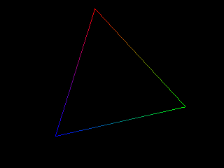

This article presents a simple line drawing algorithm. It contains sample C++ code and is accompanied by a demo program with full source code that uses SDL for display.

## Rasterization

First, a quick overview of this basic process of 3D graphics rendering is in order.

Although real-time 3D graphics rendering is a vast and complex subject area with many different concepts and techniques, most of it basically consists of simple geometric shapes, primarily triangles, that are drawn in such a way that they appear to form a much more complex image.  Many complex texturing and lighting techniques are used to dress them up, but they're still essentially just triangles. This can be easily seen from looking at wireframe models, for example.

The process of drawing the triangles is called **rasterization**. This consists of taking a geometric (or *vector*) shape and drawing it pixel-by-pixel on a pixel-based (or *raster*) image. There are various other processes for rendering images, including ray-tracing, but rasterization is currently the most common for real-time applications, such as games.

A triangle, for instance, consists of three points. But a raster image, such as what your monitor displays, consists of pixels. The rasterization process, then, is to figure out which pixels of the image are within the triangle's area and to change the color of those pixels appropriately to form a triangle in the image.

Years ago, everyone had software written to perform these tasks. These days, most of this work is automatically handled by graphics cards, which are given vector data to rasterize through APIs such as OpenGL and Direct3D. While it's not necessary to know how this stuff works, knowledge of the lower-level rendering concepts can help give you a valuable perspective when working on higher-level problems. It can be useful when you don't have a higher level API to work with, such as on some embedded platforms. With CPU power and core counts constantly increasing, there is even speculation that there may be a resurgence in software-based rendering at some point, due to the increased flexibility that you get with custom software-based rendering as opposed to working within the confines of specialized APIs and graphics hardware.

But that's all speculation for now. Aside from that, it can be a pretty interesting and fun subject to explore, so let's get started.

## Drawing Pixels

As you might have guessed, the most fundamental task in rasterization is drawing individual pixels, so let's start there. First, let's create a C++ class for representing a color (or a single pixel). It's often handy to be able to manipulate colors in a floating-point format before converting them to the integer format of raster images when it finally comes time to render them, so that's what this class will allow us to do.

Here's the class definition (check out the Color.cpp file in the demo accompanying this article for the full implementation):

```c++
class Color
{
    public:
        float R, G, B, A;

        Color(float r = 1.0f, float g = 1.0f, float b = 1.0f, float a = 1.0f);

        uint32_t ToUInt32() const;

        Color operator + (const Color &c) const;
        Color operator - (const Color &c) const;
        Color operator * (float f) const;
};
```

This class will be used for storing a color in floating-point format, with each color component (red, green, blue, and alpha for transparency) being a value from 0 to 1. We've overloaded some arithmetic operators so that we can manipulate colors easily; the addition/subtraction operators add/subtract each component of one color object to/from the corresponding component of another color, while the multiplication operator multiplies each component of a color by a scalar value.

When a pixel is ready to be drawn, the **ToUInt32()** function is used to convert the color to an unsigned 32-bit integer, where each color component (alpha, red, green, and then blue) occupies 8 bits and has a value from 0 to 255. This integer can then be written to a framebuffer that SDL gives us access to for rendering.

All rasterization will be done in a class aptly named **Rasterizer**. This class contains a few member variables that must be set using the **SetFrameBuffer()** function:

```c++
void
Rasterizer::SetFrameBuffer(uint32_t *frameBuffer,
                           unsigned int width, unsigned int height)
{
    m_FrameBuffer = frameBuffer;
    m_Width = width;
    m_Height = height;
}
```

**m_FrameBuffer** is a pointer to the framebuffer that pixels will be written to. **m_Width** contains the width of the framebuiffer and **m_Height** contains the height. To set the color of a pixel in the framebuffer, then, we have the **SetPixel()** function (there's also an overloaded version that takes floating point x/y coordinates and simply casts them to unsigned integers that are passed to the function below):

```c++
void
Rasterizer::SetPixel(unsigned int x, unsigned int y, const Color &color)
{
    if(x >= m_Width || y >= m_Height)
        return;

    m_FrameBuffer[y * m_Width + x] = color.ToUInt32();
}
```

The first thing that this function does is make sure that the **x** and **y** values make sense. If either one is outside the boundaries of the framebuffer, the function simply returns. **m_FrameBuffer** is basically an array of **m_Width** x **m_Height** pixels, with each pixel being stored left-to-right and then top-to-bottom. The array index to the pixel that needs to be set then is simply **y** multiplied by the width of the framebuffer, plus **x**. The color given is converted to an integer that's stored in the framebuffer.

To help visualize this, refer to the table below, which represents a framebuffer that's 8 pixels wide by 8 pixels high:

<table class="BorderedTable" cellspacing="0" cellpadding="0" border="0" style="width: 320px; font-size: 8pt; text-align: center">
    <tr style="background-color: #555555; color: white">
        <td style="border: 0">&nbsp;</td>
        <td style="border: 0">0</td>
        <td style="border: 0">1</td>
        <td style="border: 0">2</td>
        <td style="border: 0">3</td>
        <td style="border: 0">4</td>
        <td style="border: 0">5</td>
        <td style="border: 0">6</td>
        <td style="border: 0">7</td>
    </tr>
    <tr>
        <td style="border: 0; background-color: #555555; color: white">0</td>
        <td>0</td>
        <td>1</td>
        <td>2</td>
        <td>3</td>
        <td>4</td>
        <td>5</td>
        <td>6</td>
        <td>7</td>
    </tr>
    <tr>
        <td style="border: 0; background-color: #555555; color: white">1</td>
        <td>8</td>
        <td>9</td>
        <td>10</td>
        <td>11</td>
        <td>12</td>
        <td>13</td>
        <td>14</td>
        <td>15</td>
    </tr>
    <tr>
        <td style="border: 0; background-color: #555555; color: white">2</td>
        <td>16</td>
        <td>17</td>
        <td>18</td>
        <td style="font-weight: bold">19</td>
        <td>20</td>
        <td>21</td>
        <td>22</td>
        <td>23</td>
    </tr>
    <tr>
        <td style="border: 0; background-color: #555555; color: white">3</td>
        <td>24</td>
        <td>25</td>
        <td>26</td>
        <td>27</td>
        <td>28</td>
        <td>29</td>
        <td>30</td>
        <td>31</td>
    </tr>
    <tr>
        <td style="border: 0; background-color: #555555; color: white">4</td>
        <td>32</td>
        <td>33</td>
        <td>34</td>
        <td>35</td>
        <td>36</td>
        <td>37</td>
        <td>38</td>
        <td>39</td>
        </tr>
    <tr>
        <td style="border: 0; background-color: #555555; color: white">5</td>
        <td>40</td>
        <td>41</td>
        <td>42</td>
        <td>43</td>
        <td>44</td>
        <td>45</td>
        <td>46</td>
        <td>47</td>
    </tr>
    <tr>
        <td style="border: 0; background-color: #555555; color: white">6</td>
        <td>48</td>
        <td>49</td>
        <td>50</td>
        <td>51</td>
        <td>52</td>
        <td>53</td>
        <td>54</td>
        <td>55</td>
    </tr>
    <tr>
        <td style="border: 0; background-color: #555555; color: white">7</td>
        <td>56</td>
        <td>57</td>
        <td>58</td>
        <td>59</td>
        <td>60</td>
        <td>61</td>
        <td>62</td>
        <td>63</td>
    </tr>
</table>

The column and row headings on the top and left sides of the table represent the possible x and y positions, respectively, within the framebuffer. The other cells represent pixels within the framebuffer, and the number inside each cell is the pixel's index within the framebuffer array. If you need to access the pixel where y equals 2 and x equals 3, the index is **2 * 8 + 3**, where 8 is the width of the framebuffer in this case. The result is 19, as indicated by the bold index in the appropriate table cell above.

## Drawing Lines

Now that we're all set to draw individual pixels, let's use that ability to draw something slightly more complex - in this case, two dimensional lines. This will be done in the **DrawLine()** function of the **Rasterizer** class, which starts off as follows:

```c++
void
Rasterizer::DrawLine(const Color &color1, float x1, float y1,
                     const Color &color2, float x2, float y2)
{
    float xdiff = (x2 - x1);
    float ydiff = (y2 - y1);

    if(xdiff == 0.0f && ydiff == 0.0f) {
        SetPixel(x1, y1, color1);
        return;
    }
```

This function accepts six parameters - the color, x position, and y position of the first point of the line followed by the color, x position, and y position of the second point. The first thing that it does is calculate the differences of the given x coordinates and y coordinates. If both of the differences are 0 (that is, x1 is equal to x2 and y1 is equal to y2), the line consists of one point, so we just draw a single pixel and return.

Next, we have the following *if* statement, which checks if the absolute value of **xdiff** is greater than the absolute value of **ydiff**:

```c++
​    if(fabs(xdiff) > fabs(ydiff)) {
```

The basic method of line rendering is to loop through each whole number between the points in one dimension (x or y) and calculate the corresponding position in the other dimension using the line's slope. If there are more points in the x dimension (that is, the *if* condition above passes), we will loop through the points in the x dimension and calculate the corresponding y values; otherwise, we'll loop through the points in the y dimension and calculate the corresponding x values. Handling these two cases separately is necessary to prevent gaps in the line.

To draw the line in terms of the x dimension, we must first figure out the minimum and maximum x values that were passed to the function, since x2 may be lower than x1 and vice versa:

```c++
​        float xmin, xmax;

        // set xmin to the lower x value given
        // and xmax to the higher value
        if(x1 < x2) {
            xmin = x1;
            xmax = x2;
        } else {
            xmin = x2;
            xmax = x1;
        }
```

Next, we calculate the slope (or tangent) of the line and loop through each whole number between the minimum/maximum x values to draw it:

```c++
​        // draw line in terms of y slope
        float slope = ydiff / xdiff;
        for(float x = xmin; x <= xmax; x += 1.0f) {
            float y = y1 + ((x - x1) * slope);
            Color color = color1 + ((color2 - color1) * ((x - x1) / xdiff));
            SetPixel(x, y, color);
        }
```

Calculating the y position is a case of some fairly simple geometry; the current x position relative to the x position of the line's first point is multiplied by the slope and added to the y position of the line's first point.

The trickiest part of this is calculating the color. We want the color of the starting point of the line to be **color1**, the color of the ending point to be **color2**, and everything else to be somewhere in between. The current x position relative to the x position of the line's first point is divided by **xdiff** to give us a value between 0 and 1, where the value will be 0 at the start of the line and 1 at the end. With the help of the overloaded arithmetic operators of the **Color** class, we then use that value to linearly interpolate between the starting color and the ending color.

The **SetPixel()** function is then called to draw the pixels and we're done - at least when it comes to rendering in terms of the x dimension. The other case, rendering in terms of the y dimension, is very similar:

```c++
​    } else {
        float ymin, ymax;

        // set ymin to the lower y value given
        // and ymax to the higher value
        if(y1 < y2) {
            ymin = y1;
            ymax = y2;
        } else {
            ymin = y2;
            ymax = y1;
        }

        // draw line in terms of x slope
        float slope = xdiff / ydiff;
        for(float y = ymin; y <= ymax; y += 1.0f) {
            float x = x1 + ((y - y1) * slope);
            Color color = color1 + ((color2 - color1) * ((y - y1) / ydiff));
            SetPixel(x, y, color);
        }
    }
}
```

The only differences here are that we loop through the minimum/maximum y values and calculate the x values instead of the other way around. Also note that we use the reciprocal of the previous slope (or the cotangent) to calculate x values.

That's the end of the function, and it's now ready for use. There are certainly many ways that this function could be optimized, but we're aiming for simplicity, and this is certainly fine for simple line drawing. We'll be more interested in rendering fully shaded and textured triangles pretty soon, anyway.

Here's a screenshot of the demo program:



The C++ source code for the demo can be found [on GitHub](https://github.com/joshb/linedrawing). The demo requires [SDL](http://www.libsdl.org/).
