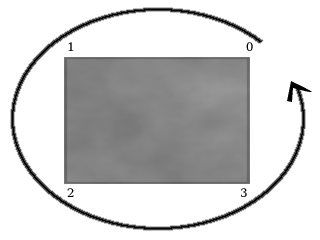
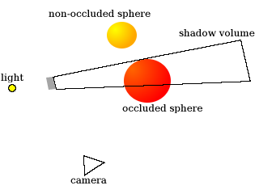
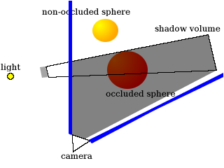
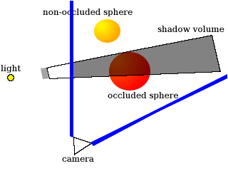
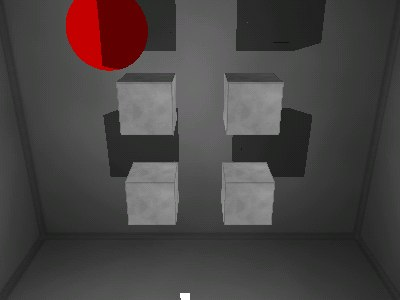

This article explains how to implement shadows in OpenGL, using the popular stenciled shadow volumes technique. Features sample C code and is accompanied by a demo written in C.

If you read my previous article, [Dynamic Lightmaps in OpenGL](../dynamic_lightmaps_in_opengl/), you may have noticed that, while dynamic lightmaps can look nice, they don't take into account an effect closely related to lighting: shadowing. Though it would be possible to trace a ray from the light's position to the position of each pixel of a lightmap, to determine if something is between the light and pixel (thus shadowing the pixel), that would probably be too slow to do in real-time, so we need another technique to do the shadows.

One popular technique is stenciled shadow volumes. As the name implies, the technique makes use of the stencil buffer. If you're not familiar with the stencil buffer, you may want to learn about that before reading this article.

## Shadow Volumes

So, what is a shadow volume anyway?

Basically, it's a "volume" (or a kind of model) which encloses every point which could possibly be shadowed by an object. Anything inside the volume should be shadowed. The volume is rendered in a way that causes shadowed pixels to have stencil values that differ from non-shadowed pixels.

Determining and rendering the shadow volume is the most complex part of using stenciled shadow volumes; it's a good subject to cover by itself. Although we'll be using a pretty simple method for creating shadow volumes of simple geometry in this article, it wouldn't be very efficient to render the shadow volumes of hundreds or thousands of polygons this way. The method used in this article can also cause some artifacts where the edges of shadow volumes meet (because there's a single shadow volume rendered for each polygon), which could be solved by rendering a single volume that surrounds an entire model, instead of rendering separate volumes for each polygon of a model.

In the demo accompanying this article, we have a **surface** structure which represents a quadrilateral surface:

```c++
​    struct surface {
        float vertices[4][3];
        float matrix[9];

        float s_dist, t_dist;
    };
```

The **vertices** array contains four 3D vectors representing each vertex of a quadrilateral surface. **matrix**, **s_dist** and **t_dist** are used for lightmap generation, so they're irrelevant to this article; see my [Dynamic Lightmaps in OpenGL](../dynamic_lightmaps_in_opengl/) article if you're interested in lightmaps.

We also have a **cube** structure, which just makes it easy to store a cube model that's made up of six surfaces:

```c++
​    struct cube {
        struct surface *surfaces[6];
        float position[3];
    };
```

The **surfaces** array contains pointers to each of the six surfaces required to make up a cube. **position** is a 3D vector representing the position of the cube.

Now let's look at the function that renders a surface's shadow volume. The **render_surface_shadow_volume** function will render a shadow volume for the **surface** that is passed to it:

```c++
​    static void
    render_surface_shadow_volume(struct surface *surf,
                                 float *surf_pos, float *light_pos)
    {
        int i;
        float v[4][3];
```

The **surf** argument is a pointer to a surface, the **surf_pos** argument is a pointer to a 3D vector representing the surface's position, and **light_pos** is a pointer to a 3D vector representing the position of the light that's blocked by the surface (thus causing a shadow).

```c++
​        for(i = 0; i < 4; i++) {
            surf->vertices[i][0] += surf_pos[0];
            surf->vertices[i][1] += surf_pos[1];
            surf->vertices[i][2] += surf_pos[2];

            v[i][0] = (surf->vertices[i][0] - light_pos[0]);
            v[i][1] = (surf->vertices[i][1] - light_pos[1]);
            v[i][2] = (surf->vertices[i][2] - light_pos[2]);
            normalize(v[i]);
            v[i][0] *= M_INFINITY;
            v[i][1] *= M_INFINITY;
            v[i][2] *= M_INFINITY;
            v[i][0] += light_pos[0];
            v[i][1] += light_pos[1];
            v[i][2] += light_pos[2];
        }
```

The above loop does two things: first, it adds the surface's position to each of the surface's vertices. This is just for convenience, and the position will be subtracted from the surface's vertices at the end of the function. Second, it stores in the **v** array the surface's vertices extruded towards infinity in the direction from the light to each vertex. Remember that a shadow volume is supposed to enclose every possible point that could be shadowed, so it must start from the surface and end at the furthest distance away that an occluded object could be. Of course, multiplying a vertex by **M_INFINITY** (which is defined as 50.0f in the demo) doesn't really extrude it to infinity, but it does extrude it beyond the furthest distance away that an occluded object could be in this demo. An improvement over this would be to use an "infinite projection matrix", but we'll use the method above in order to keep things simple.

One thing to keep in mind is that the order in which we give the vertices to glVertex3fv when drawing polygons matters. In the demo, if the vertices are drawn in a counter-clockwise order from the viewer's position, then the polygon is facing the viewer (you'll see why this is important when we perform the stencil operations later on). Here's an image to show you what I mean:



In the image, each vertex of the gray surface is numbered from 0 to 3. The curved line with an arrow at the end shows how the vertices are drawn in a counter-clockwise order.

Next, we'll render the back and front caps of the shadow volume; basically, the front cap is the same as the surface itself, and the back cap is the surface extruded towards infinity. This will insure that we have a closed shadow volume, which is needed for the stencil operations we'll do later.

```c++
​        /* back cap */
        glBegin(GL_QUADS);
            glVertex3fv(v[3]);
            glVertex3fv(v[2]);
            glVertex3fv(v[1]);
            glVertex3fv(v[0]);
        glEnd();

        /* front cap */
        glBegin(GL_QUADS);
            glVertex3fv(surf->vertices[0]);
            glVertex3fv(surf->vertices[1]);
            glVertex3fv(surf->vertices[2]);
            glVertex3fv(surf->vertices[3]);
        glEnd();
```

The next loop will render a quadrilateral for each edge of the surface, resulting in four quads. Each quadrilateral will start at the edge of the surface itself, and end at the corresponding edge of the extruded back cap of the surface.

```c++
​        glBegin(GL_QUAD_STRIP);
        glVertex3fv(surf->vertices[0]);
        glVertex3fv(v[0]);
        for(i = 1; i <= 4; i++) {
            glVertex3fv(surf->vertices[i % 4]);
            glVertex3fv(v[i % 4]);
        }
        glEnd();
```

Next we subtract the surface position from each of its vertices, as mentioned earlier, and the function is done.

```c++
​        for(i = 0; i < 4; i++) {
            surf->vertices[i][0] -= surf_pos[0];
            surf->vertices[i][1] -= surf_pos[1];
            surf->vertices[i][2] -= surf_pos[2];
        }
    }
```

## Stencil Operations and Rendering

Now that we have a function to render shadow volumes, let's put it to use. There are a few slightly different methods of doing the stenciling portion of stenciled shadow volumes; the method used below is generally called "depth fail" (or "Z fail"), because it consists of two passes that modify the stencil value when the depth test fails.

Before doing any shadow volume rendering, we must make sure that we've already rendered every object that could be shadowed, with the depth buffer set accordingly, since the depth buffer will be used to determine what is shadowed.

The **render_cube_shadow** will render a shadow volume for each surface of a cube, modifying the stencil buffer appropriately. Here's how the function and its loop start out:

```c++
​    static void
    render_cube_shadow(struct cube *c)
    {
        int i;

        for(i = 0; i < 6; i++) {
            glColorMask(GL_FALSE, GL_FALSE, GL_FALSE, GL_FALSE);
            glDepthMask(GL_FALSE);
            glEnable(GL_CULL_FACE);
            glEnable(GL_STENCIL_TEST);
            glEnable(GL_POLYGON_OFFSET_FILL);
            glPolygonOffset(0.0f, 100.0f);
```

The first thing we do in the loop, shown above, is disable writing to the color and depth buffers, since we're only concerned with updating the stencil buffer for now. Next, we enable front/back face culling and enable stencil testing. Last, we enable and set a polygon offset, in order to work around some depth buffer precision issues ("Z-fighting") when rendering a surface's shadow volume over the surface itself.

Before getting to the stencil operations and shadow volume rendering, let's take a look at an image that will help in explaining the stencil operations:



In the image above, the triangle at the bottom is the "camera", which is to show you from where the viewer would be seeing the objects in the scene. There's a light on the left side of the image that's being blocked by a small gray surface, thus creating a shadow volume. The "occluded sphere" is partially inside the shadow volume - any part that's inside the shadow volume should be shadowed.

In order for the stencil operations to be carried out correctly, we'll render the shadow volume in two passes. Let's take a look at the first pass:

```c++
​            glCullFace(GL_FRONT);
            glStencilFunc(GL_ALWAYS, 0x0, 0xff);
            glStencilOp(GL_KEEP, GL_INCR, GL_KEEP);
            render_surface_shadow_volume(c->surfaces[i], c->position, light_pos);
```

In the bit of code above, we cause front faces (that is, polygons facing towards the viewer) to be culled, so that only back faces are drawn. The stencil operations above basically mean that when the depth test fails (that is, a pixel of the polygon is further away than the pixel that's already stored in its place on the screen), we increment the pixel's stencil value.

What would this look like if we applied it to the image above? Let's see:



The blue lines represent the camera's view frustum, so only pixels inside of that frustum have stencil values. The shaded portion of the above image is where the stencil value would be incremented. Because the stencil value is incremented when the depth test fails, everything between the camera and the back faces we rendered has its stencil value incremented.

As you can see, the entire "occluded sphere" is considered to be shadowed at this point, which is wrong. That's where the second pass comes in:

```c++
​            glCullFace(GL_BACK);
            glStencilFunc(GL_ALWAYS, 0x0, 0xff);
            glStencilOp(GL_KEEP, GL_DECR, GL_KEEP);
            render_surface_shadow_volume(c->surfaces[i], c->position, light_pos);
```

The code above causes back faces to be culled, so that only front faces are drawn. The stencil operations mean that when the depth test fails, we decrement the pixel's stencil value. Here's how it would affect the last image:



So there you go. The stencil values now correctly indicate which portions of the image are shadowed.

Now let's finish up the loop and the function:

```c++
​            glDisable(GL_POLYGON_OFFSET_FILL);
            glDisable(GL_CULL_FACE);
            glColorMask(GL_TRUE, GL_TRUE, GL_TRUE, GL_TRUE);
            glDepthMask(GL_TRUE);

            glStencilFunc(GL_NOTEQUAL, 0x0, 0xff);
            glStencilOp(GL_REPLACE, GL_REPLACE, GL_REPLACE);
            draw_shadow();
            glDisable(GL_STENCIL_TEST);
        }
    }
```

In the above bit of code, we disable the polygon offset and front/back face culling, and re-enable writing to the color and depth buffers. Then we set the stencil operations to reset each pixel's stencil value for anything we draw, and we call **draw_shadow**, which just fills the screen with a dark quad - however, due to the stencil operations we performed when rendering the back and front faces of the surface's shadow volume, the dark quad will color in only the areas that have been shadowed by the surface.

Once we've called draw_shadow, we disable stencil testing, end the loop, and we're done. Here's a screenshot of the demo (the four cubes in the middle project shadows; the sphere doesn't, but is occluded by the cubes' shadows):



The full source code for the demo can be found on [GitHub](https://github.com/joshb/shadowvolumes). It's distributed under a BSD-style license, so you can use it and/or modify it for your own projects.

(Update on August 31, 2008: Thanks to Tong for pointing out that **light_pos** should be added to each vertex in the **v** array after the vertices are multiplied by **M_INFINITY** - this is because the vertices stored in **v** are supposed to be the extruded surface vertices projected from the light position. This change fixes some small rendering issues in the demo. The code in the article and the demo program has been updated to reflect this change.)
