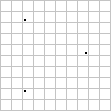
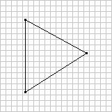
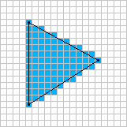
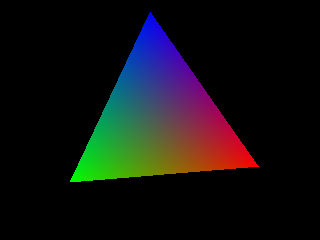

This article presents an algorithm for drawing (or "rasterizing") triangles. It contains sample C++ code and is accompanied by a demo program with full source code that uses SDL for display.

## Overview of Triangle Rasterization

There are three main steps to triangle rasterization, as illustrated in the figures below (each figure represents a 20x20 grid of pixels):

<table cellspacing="0" cellpadding="4" border="0">
<tbody>
    <tr style="font-size: 8pt; text-align: center">
    <td>
        
        <br />
        Figure 1
    </td>
    <td>
        
        <br />
        Figure 2
    </td>
    <td>
        
        <br />
        Figure 3
    </td>
    </tr>
</tbody>
</table>

The first figure shows the three points (represented by black dots) that are the three vertices of a triangle. The second figure shows the *edges* of the triangle; these are the three lines that connect the points and form an outline of the triangle. Last, we have the fully drawn triangle in the third figure, which is made up of horizontal lines of blue pixels that are within the boundaries of the triangle.

So the first step is to use the three points to determine the edges of the triangle. Next, we loop through the y axis boundaries of the triangle to calculate the horizontal *spans* that the triangle consists of; these are the horizontal lines that will form the triangle. Any row of pixels within the outline of the triangle is a span. Finally, we loop through the x axis boundaries of each span to draw each individual pixel.

Let's now dive into the code for doing all of this, starting with the first step: edge calculation.

## Edge Calculation

First, we need a class to represent a single edge of a triangle. Here's the definition of the class:

```c++
class Edge
{
    public:
        Color Color1, Color2;
        int X1, Y1, X2, Y2;

        Edge(const Color &color1, int x1, int y1, const Color &color2, int x2, int y2);
};
```

This class contains color, x, and y values for the two points that an edge consists of. The only function is the constructor, which is shown below:

```c++
Edge::Edge(const Color &color1, int x1, int y1,
           const Color &color2, int x2, int y2)
{
    if(y1 < y2) {
        Color1 = color1;
        X1 = x1;
        Y1 = y1;
        Color2 = color2;
        X2 = x2;
        Y2 = y2;
    } else {
        Color1 = color2;
        X1 = x2;
        Y1 = y2;
        Color2 = color1;
        X2 = x1;
        Y2 = y1;
    }
}
```

When we're looping through the y axis, we want to start with lower values and end with higher ones, so this constructor simply makes sure that the first point of the edge is the point with the lower y value of the two given.

Let's now take a look at the **DrawTriangle()** function of the **Rasterizer** class, which creates an array of edges from the three points given:

```c++
void
Rasterizer::DrawTriangle(const Color &color1, float x1, float y1,
                         const Color &color2, float x2, float y2,
                         const Color &color3, float x3, float y3)
{
    // create edges for the triangle
    Edge edges[3] = {
        Edge(color1, (int)x1, (int)y1, color2, (int)x2, (int)y2),
        Edge(color2, (int)x2, (int)y2, color3, (int)x3, (int)y3),
        Edge(color3, (int)x3, (int)y3, color1, (int)x1, (int)y1)
    };
```

The first edge is from point one to point two, the second edge is from point two to point three, and the third edge is from point three to point one.

Let's refer back to the figures shown earlier in the article for a moment. Notice that one edge of the triangle (the vertical one on the left) spans the entire length of the triangle in the y axis, whereas the other two edges span roughly half of the length in the y axis. When we're drawing triangles, one edge will always have a length in the y axis greater than either of the other two edges (actually, it's possible that two edges have the same length in the y axis and the third has a 0 length, but our code will handle that situation as well); its length in the y axis will be the sum of the lengths of the other two edges.

The following bit of code is used to find the index of the tallest edge (the one with the greatest length in the y axis) in the **edges** array:

```c++
​    int maxLength = 0;
    int longEdge = 0;

    // find edge with the greatest length in the y axis
    for(int i = 0; i < 3; i++) {
        int length = edges[i].Y2 - edges[i].Y1;
        if(length > maxLength) {
            maxLength = length;
            longEdge = i;
        }
    }
```

Next, we get the indices of the shorter edges, using the modulo operator to make sure that we stay within the bounds of the array:

```c++
​    int shortEdge1 = (longEdge + 1) % 3;
    int shortEdge2 = (longEdge + 2) % 3;
```

Next, we pass the edges to the **DrawSpansBetweenEdges()** function, which will calculate the horizontal spans between two edges of the triangle and send them to another function for drawing indivudal spans; we call this function twice, passing in the tall edge along with each of the short edges, and the **DrawTriangle()** function is done:

```c++
​    // draw spans between edges; the long edge can be drawn
    // with the shorter edges to draw the full triangle
    DrawSpansBetweenEdges(edges[longEdge], edges[shortEdge1]);
    DrawSpansBetweenEdges(edges[longEdge], edges[shortEdge2]);
}
```

As mentioned earlier, the tall edge's length in the y axis is the sum of the lengths in the y axis of the other two edges. Because the two short edges have different slopes, we take one short edge at a time to calculate the minimum/maximum x values of each span within the edge's boundaries. Let's now look at how we calculate the spans.

## Span Calculation

Just like we have a class to represent edges, we have one to represent spans. Here's the definition:

```c++
class Span
{
    public:
        Color Color1, Color2;
        int X1, X2;

        Span(const Color &color1, int x1, const Color &color2, int x2);
};
```

This is similar to the **Edge** class, but it has no y values because spans are always parallel to the x axis; the function for drawing a single span (shown later in the article) will take a single y value to draw at along with a span. The constructor of the **Span** class makes sure that the first point stored is the one with the lower x value:

```c++
Span::Span(const Color &color1, int x1, const Color &color2, int x2)
{
    if(x1 < x2) {
        Color1 = color1;
        X1 = x1;
        Color2 = color2;
        X2 = x2;
    } else {
        Color1 = color2;
        X1 = x2;
        Color2 = color1;
        X2 = x1;
    }
}
```

Span calculation is performed by the **DrawSpansBetweenEdges()** function. This function first takes the differences between the y positions of the points for the given edges. If either of them is 0, there are no spans to render and the function simply returns:

```c++
void
Rasterizer::DrawSpansBetweenEdges(const Edge &e1, const Edge &e2)
{
    // calculate difference between the y coordinates
    // of the first edge and return if 0
    float e1ydiff = (float)(e1.Y2 - e1.Y1);
    if(e1ydiff == 0.0f)
        return;

    // calculate difference between the y coordinates
    // of the second edge and return if 0
    float e2ydiff = (float)(e2.Y2 - e2.Y1);
    if(e2ydiff == 0.0f)
        return;
```

Next, we also calculate the differences of the x positions and colors of the points for the given edges, as this will make it a little easier to interpolate x and color values for each span:

```c++
​    // calculate differences between the x coordinates
    // and colors of the points of the edges
    float e1xdiff = (float)(e1.X2 - e1.X1);
    float e2xdiff = (float)(e2.X2 - e2.X1);
    Color e1colordiff = (e1.Color2 - e1.Color1);
    Color e2colordiff = (e2.Color2 - e2.Color1);
```

The last task before looping through each span is initializing factors for interpolating values between the two points of the given edges, and step values for increasing the factors each time the loop runs:

```c++
​    // calculate factors to use for interpolation
    // with the edges and the step values to increase
    // them by after drawing each span
    float factor1 = (float)(e2.Y1 - e1.Y1) / e1ydiff;
    float factorStep1 = 1.0f / e1ydiff;
    float factor2 = 0.0f;
    float factorStep2 = 1.0f / e2ydiff;
```

When this function is called, the first edge given must be the long edge and the second edge given must be one of the short ones. We're going to loop from the minimum y value of the second edge to the maximum y value of the second edge to calculate spans, since every span within the boundaries of the short edge will also be within the boundaries of the long edge. **factor2** starts at 0 and is increased by **factorStep2** until it reaches a value of 1 towards the end of the loop. **factor1**, however, may start with a value greater than 0 (if the long edge's starting y value is lower than the short edge's) or may end up at a value lower than 1 (if the long edge's ending y value is greater than the short edge's).

Here's the loop that calculates spans and passes them to the **DrawSpan()** function to draw them:

```c++
​    // loop through the lines between the edges and draw spans
    for(int y = e2.Y1; y < e2.Y2; y++) {
        // create and draw span
        Span span(e1.Color1 + (e1colordiff * factor1),
              e1.X1 + (int)(e1xdiff * factor1),
              e2.Color1 + (e2colordiff * factor2),
              e2.X1 + (int)(e2xdiff * factor2));
        DrawSpan(span, y);

        // increase factors
        factor1 += factorStep1;
        factor2 += factorStep2;
    }
}
```

The x and color values for each span are interpolated from the first point of each edge to the second point, similarly to the line drawing function from our last tutorial. Once the loop finishes, the function is complete. Let's now take a look at the **DrawSpan()** function, which is where we draw each individual pixel of a span.

## Span Drawing

Span drawing is basically like drawing a one-dimensional line that exists only in the x axis. We loop from the minimum x value of the span to the maximum x value, interpolating the color and setting pixels along the way.

Here's how the **DrawSpan()** function starts. We calculate the differences between the starting/ending x/color values of the span and, if the x difference is 0, simply return because there are no pixels to draw:

```c++
void
Rasterizer::DrawSpan(const Span &span, int y)
{
    int xdiff = span.X2 - span.X1;
    if(xdiff == 0)
        return;

    Color colordiff = span.Color2 - span.Color1;
```

Next, we initialize a factor for interpolating the color between the beginning and end of the span, and calculate a step value for incrementing the factor each time the loop runs:

```c++
​    float factor = 0.0f;
    float factorStep = 1.0f / (float)xdiff;
```

Finally, we loop through each x position in the span and set pixels using the y value passed to this function and a calculated color value:

```c++
​    // draw each pixel in the span
    for(int x = span.X1; x < span.X2; x++) {
        SetPixel(x, y, span.Color1 + (colordiff * factor));
        factor += factorStep;
    }
}
```

The function is finished, and with that, our triangle rasterization algorithm is complete. Here's a screenshot of the demo program:



The C++ source code for the demo can be found [on GitHub](https://github.com/joshb/triangleraster). The demo requires [SDL](http://www.libsdl.org/).
