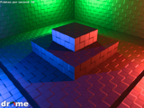
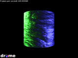
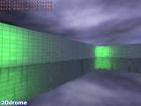
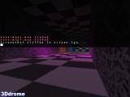
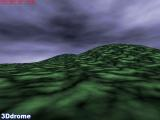
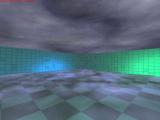
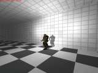

Drome Engine is a 3D game engine that's written in C++ and uses OpenGL for graphics rendering. It is open source software available under a BSD-style license.

## Features

Some of Drome Engine's features include:

- GLSL shader support
- Particle effects
- PNG and PCX image loading
- TrueType font loading and rendering
- Simple physics
- Resource management with reference counting that causes unused resources (such as textures) to be removed from memory automatically

## Platforms

Drome Engine has been developed and tested on the following operating systems:

- Mac OS X
- iOS
- Arch Linux
    
## Download

The latest version of Drome Engine can be found [on GitHub](https://github.com/joshb/DromeEngine).

## Screenshots

Click any image below to view a larger version.

<table border="0" cellpadding="0" cellspacing="16" style="font-size: smaller; text-align: center">
    <colgroup>
        <col style="width: 160px" />
        <col style="width: 160px" />
        <col style="width: 160px" />
    </colgroup>
    <tr>
        <td>
            
            Normal/shadow mapping with GLSL vertex/fragment shaders
        </td>
        <td>
            
            Normal mapping with GLSL vertex/fragment shaders
        </td>
    </tr>
</table>

## Screenshots from old versions

<table border="0" cellpadding="0" cellspacing="16" style="font-size: smaller; text-align: center">
    <colgroup>
        <col style="width: 160px" />
        <col style="width: 160px" />
        <col style="width: 160px" />
    </colgroup>
    <tr>
        <td>
            
            Dynamic lighting, water with dynamic reflection
        </td>
        <td>
            
            Using one of the <a href="http://www.gnome.org/fonts/">Bitstream Vera</a> fonts as the console font
        </td>
        <td>
            
            Terrain, sky dome
        </td>
    </tr>
    <tr>
        <td>
            
            Multi-colored dynamic lighting, sky dome, water
        </td>
        <td>
            
            Dynamic lighting with a shadow projected from a standard Quake&nbsp;II model
        </td>
    </tr>
</table>
